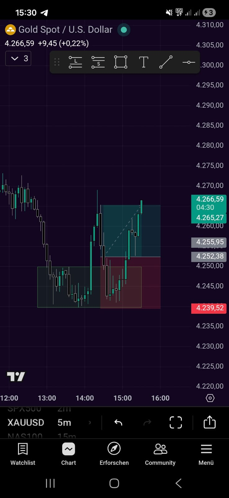
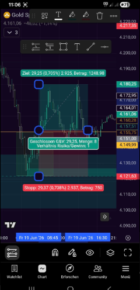

# Trading Analyzer

Eine Android-App, die TradingView-Screenshots per KI auswertet und die wichtigsten Trade-Kennzahlen lokal speichert und visualisiert.

## Funktionsweise

1. **Erfassen** – Screenshot aus der Galerie wählen. Die App sendet das Bild an ein NVIDIA-Vision-Modell (NIM-API), das automatisch Symbol, Richtung (long/short), Einstiegskurs, Stop-Loss, Take-Profit und Ein-/Ausstiegszeiten aus dem TradingView-Positions-Tool extrahiert.
2. **Prüfen & Speichern** – Die KI-Ergebnisse werden in ein editierbares Formular übernommen. CRV, Risiko-/Zielpunkte und Haltedauer werden live berechnet. Nach Korrektur wird der Trade lokal gespeichert.
3. **Trades** – Übersicht aller gespeicherten Trades mit Statistik-Kacheln (Win-Rate, Ø CRV, Gesamtpunkte) und einem kumulierten Punkte-Diagramm.
4. **Einstellungen** – NVIDIA-API-Key wird verschlüsselt auf dem Gerät gespeichert (Android EncryptedSharedPreferences).

## Screenshots

| Leer | Mit Daten |
|------|-----------|
|  |  |

## Tech-Stack

| Schicht | Technologie |
|---------|-------------|
| UI | Jetpack Compose + Material 3 |
| Datenbank | Room (SQLite) |
| Netzwerk | OkHttp (direkter NVIDIA-NIM-Aufruf) |
| Bildspeicher | Coil |
| API-Key-Speicher | AndroidX Security Crypto |
| Build | Kotlin + KSP, Gradle Version Catalogs |

## Modell-Flavors

Die App wird in zwei APK-Varianten gebaut, die parallel installierbar sind:

| Flavor | Modell | Besonderheit |
|--------|--------|--------------|
| `nanoVl` | `nvidia/nemotron-nano-12b-v2-vl` | Schnell, kein Reasoning |
| `omniReasoning` | `nvidia/nemotron-3-nano-omni-30b-a3b-reasoning` | Erweitertes Chain-of-Thought-Reasoning, höheres Token-Budget |

## Voraussetzungen

- Android 7.0+ (minSdk 24)
- [NVIDIA NIM API-Key](https://build.nvidia.com/) (kostenlos registrieren)
- Android Studio Ladybug oder neuer

## Build & Installation

```bash
# Debug-APKs beider Flavors bauen
./gradlew assembleDebug

# Nur einen Flavor
./gradlew assembleNanoVlDebug
./gradlew assembleOmniReasoningDebug
```

Die APKs liegen anschließend unter `app/build/outputs/apk/<flavor>/debug/`.

Nach der Installation den NVIDIA-API-Key in der App unter **Einstellungen** eintragen.

## Projektstruktur

```
app/src/main/java/com/example/tradinganalyser/
├── data/           # Room-Datenbank, Trade-Entity, DAO, Repository
├── network/        # NVIDIA-API-Aufruf und JSON-Parsing (AnalyzerService)
├── ui/             # Compose-Screens und ViewModels
│   └── components/ # PnlChart, StatCard
└── util/           # Berechnungen (CRV, Punkte, Haltedauer) und Parsing
```

## Datenschutz

- Der API-Key wird ausschließlich lokal und verschlüsselt gespeichert.
- Bilder und Trade-Daten verbleiben auf dem Gerät; lediglich der gewählte Screenshot wird zur Analyse an die NVIDIA-API übertragen.
